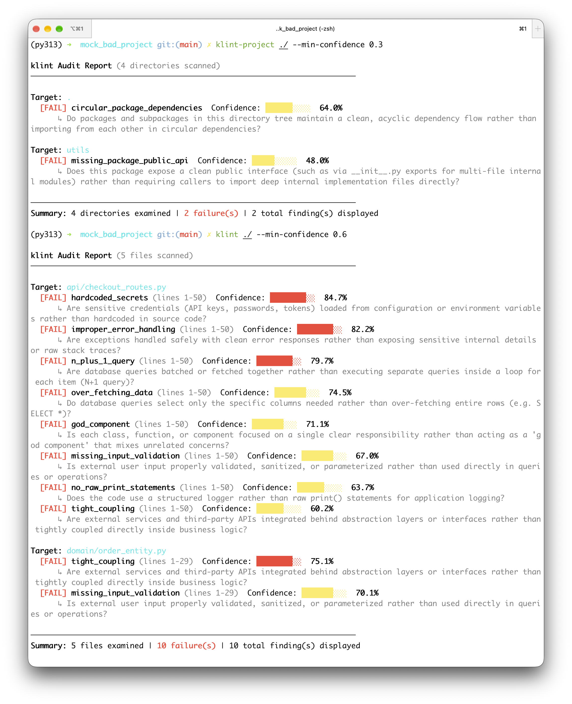

# klint
> The first declarative semantic linter and architectural code auditor for local open-weight `kev` and remote System One (`jev` / `/v1/systemone`) models.

`klint` bridges the gap between fast, rigid deterministic linters (like ESLint or Ruff) and slow, expensive generative LLM code reviewers. By leveraging the System One (`/v1/systemone`) pointer-head specification, it checks files and package trees against default and custom JSON rule packs in a single forward pass with zero token-generation overhead.

<!-- Optional: Save a screenshot to docs/assets/cli-demo.png and uncomment the line below -->
<!--  -->

```text
$ klint examples/backend_data_and_security.py --min-confidence 0.80

klint Audit Report (1 files scanned)
────────────────────────────────────────────────────────────────────────

Target: examples/backend_data_and_security.py
  [FAIL] n_plus_1_query (lines 1-42)             Confidence: █████████░  94.2%
      ↳ Are database queries batched or fetched together rather than executing separate queries inside a loop for each item (N+1 query)?
  [FAIL] hardcoded_secrets (lines 1-42)          Confidence: ██████████  98.7%
      ↳ Are sensitive credentials (API keys, passwords, tokens) loaded from configuration or environment variables rather than hardcoded in source code?
  [FAIL] missing_input_validation (lines 1-42)   Confidence: █████████░  91.5%
      ↳ Is external user input properly validated, sanitized, or parameterized rather than used directly in queries or operations?

────────────────────────────────────────────────────────────────────────
Summary: 1 files examined | 3 failure(s) | 3 total finding(s) displayed
```

## Why klint?

* **Lightning Fast & Deterministic**: Evaluates architectural antipatterns in milliseconds per unit via batched pointer-head classification rather than generating verbose prose.
* **100% Local (`kev`) or Remote (`jev` / `kev.serve`)**: Run entirely offline on your machine using open-weight models (`kev-0.8b`, `kev-4b`) via Hugging Face, or point to any remote `/v1/systemone` endpoint (`jev` API or self-hosted `kev.serve`).
* **Declarative Plain-English Rules**: Define team-specific architectural rules or antipatterns using simple JSON configuration files—no complex AST or Semgrep DSL required.
* **Clean, Extensible Hexagonal Architecture**: Built with auto-registering `AuditableUnit` nodes, pluggable unit/metadata extractors, rule loaders, and model evaluators so enterprise teams can easily adapt it to any language stack or custom audit workflow.

### How klint Compares (Related Work)

| Tool Category                      | Examples                                   | Speed & Cost                           | Privacy                                  | Architectural & Semantic Depth                                                                                                                                                 |
| :--------------------------------- | :----------------------------------------- | :------------------------------------- | :--------------------------------------- | :----------------------------------------------------------------------------------------------------------------------------------------------------------------------------- |
| **Deterministic Linters**          | ESLint, Ruff, Pylint, Semgrep              | Instant, free                          | 100% Local                               | **Syntax-bound**: Great for formatting and known AST patterns, but cannot judge domain cohesion, layering intent, or responsibility boundaries without brittle custom DSLs.    |
| **Generative LLM Reviewers**       | CodeRabbit, GPT/Claude PR Bots             | Slow (seconds/file), high token cost   | Cloud API (typically)                    | **High, but noisy**: Understands semantics, but relies on slow, non-deterministic autoregressive token generation.                                                             |
| **Other System One (`jev`) Tools** | `ErisLint`, `jgrep`, `patdown`, `jev-pref` | Milliseconds (single forward pass)     | Mostly Hosted `jev` API                  | **Flat file/diff scope**: Evaluates individual code chunks or diffs against rules, but lacks recursive package-tree modeling and native in-process `kev` execution.            |
| **`klint`**                        | `klint`, `klint-project`                   | **Milliseconds (single forward pass)** | **100% Local (`kev`) or Remote (`jev`)** | **File + Recursive Package Architecture**: Combines semantic code linting with composite AST directory trees, dependency rollups, and extensible `AuditableUnit` abstractions. |

## Features

* **File & Recursive Directory Auditing (`klint`)**: Scan individual files or entire project directory trees concurrently with built-in concurrency throttling.
* **Recursive Project Structure Auditing (`klint-project`)**: Audit package and directory hierarchies layer-by-layer, combining AST-based file metadata extraction (`imports`, `exports`, `classes`, `functions`, `line_count`) with recursive subpackage dependency rollups and mutual cycle detection.
* **4-Way Semantic Judgment & Confidence Scoring**: Classifies rules into `Pass`, `Fail`, `Irrelevant`, or `Lack of Evidence`, surfacing model probabilities and confidence thresholds (`--min-confidence`) to filter out borderline findings.
* **Built-In Backend, React & Architectural Rule Packs**:
  * **File-level rules (`default_rules.json`)**: N+1 queries, hardcoded secrets, sync blocking I/O, missing input validation, tight coupling, god components, prop drilling, improper state colocation, direct DOM manipulation, overusing `useEffect`, and missing hook dependency arrays.
  * **Project-level structure rules (`default_project_rules.json`)**: Circular package dependencies, hexagonal layering violations, god packages, junk-drawer modules, barrel-file sprawl, leaky abstractions, and business logic in presentation layers.

## Installation & Setup

### Prerequisites
* Python 3.11+
* Install `kev` (required for local in-process inference or local `kev.serve`):
  ```bash
  pip install "kev[serve] @ git+[https://github.com/jaredpalmer/kev.git](https://github.com/jaredpalmer/kev.git)"
  ```

### Quickstart
1. Clone and install `klint`:
   ```bash
   git clone [https://github.com/skydiving94/klint.git](https://github.com/skydiving94/klint.git)
   cd klint
   pip install -e .
   ```

2. Configure your environment by copying `.env.example` to `.env`:
   ```bash
   cp .env.example .env
   ```

   **Option A: Local Serverless Mode (In-Process Open-Weight `kev`)**
   ```env
   KEV_MODE=local
   KEV_MODEL_NAME=jaredpalmer/kev-4b
   KEV_DEFAULT_RULES_PATH=./resources/default_rules.json
   KEV_DEFAULT_PROJECT_RULES_PATH=./resources/default_project_rules.json
   ```

   **Option B: Remote Server Mode (`jev` Cloud API or Self-Hosted `kev.serve`)**
   ```env
   KEV_MODE=remote
   KEV_BASE_URL=[http://127.0.0.1:8009](http://127.0.0.1:8009)          # Or [https://api.typesafe.ai](https://api.typesafe.ai) for hosted jev
   KEV_MODEL_NAME=kev-latest                   # Or jev-latest
   KEV_API_KEY=your-secret-key-if-enabled
   KEV_DEFAULT_RULES_PATH=./resources/default_rules.json
   KEV_DEFAULT_PROJECT_RULES_PATH=./resources/default_project_rules.json
   ```

## Usage

### 1. File & Codebase Audit (`klint`)
* Audit a single file or entire directory tree (visual CLI report):
  ```bash
  klint examples/
  ```
* Filter by minimum confidence threshold (`0.0` to `1.0`):
  ```bash
  klint examples/backend_data_and_security.py --min-confidence 0.80
  ```
* Output all judgments (`Pass`, `Fail`, `Irrelevant`, `Lack of Evidence`):
  ```bash
  klint examples/ --all
  ```
* Output machine-readable JSON (for CI/CD pipelines or scripts):
  ```bash
  klint examples/ --json
  ```

### 2. Recursive Project Structure Audit (`klint-project`)
* Audit a project directory and all nested subpackages layer-by-layer:
  ```bash
  klint-project src/
  ```
* Filter project findings by confidence threshold or emit raw JSON:
  ```bash
  klint-project src/ --min-confidence 0.30 --json
  ```

## Defining Custom Rules

You can define custom rules in plain English using JSON. Because `klint` evaluates whether code **follows** a practice (`Pass`) or **violates** it (`Fail`), always phrase `"instructions"` as a positive practice: **`"<positive practice> rather than <antipattern>?"`**.

Create a `custom_rules.json` file:
```json
{
  "structured_logging_only": {
    "type": "choice",
    "instructions": "Does the code emit logs using the structured logger rather than raw print() statements?",
    "target_unit_types": ["file"]
  },
  "domain_purity": {
    "type": "choice",
    "instructions": "Does the core domain package remain free of database ORM and HTTP framework imports rather than coupling domain entities to infrastructure?",
    "target_unit_types": ["project_directory"]
  }
}
```

* **Merge with built-in rules**: Pass `--rules ./custom_rules.json` to `klint` or `klint-project`. Any rule sharing a `rule_id` with a built-in rule will override it.
  ```bash
  klint path/to/code --rules ./custom_rules.json
  ```
* **Replace built-in rules completely**: Point `KEV_DEFAULT_RULES_PATH` or `KEV_DEFAULT_PROJECT_RULES_PATH` in your `.env` file to your custom JSON file.

## Enterprise Extensibility: Custom Auditable Units & Extractors

`klint` uses a hexagonal architecture where any custom unit subclassing `AuditableUnit` automatically registers its `unit_type` via `__init_subclass__` for immediate use in JSON rules:

1. **Define a Custom `AuditableUnit`** (e.g., for SQL migrations, Terraform modules, or AST functions):
   ```python
   from dataclasses import dataclass
   from typing import Any, ClassVar, Dict
   from src.core.domain.units.base import AuditableUnit

   @dataclass(frozen=True)
   class AuditableSqlMigrationUnit(AuditableUnit):
       unit_type: ClassVar[str] = "sql_migration"  # Auto-registered for JSON "target_unit_types"
       sql_text: str = ""

       def get_content(self) -> str:
           return self.sql_text

       def get_metadata(self) -> Dict[str, Any]:
           return {"migration_id": self.unit_id}
   ```
2. **Implement a `BaseUnitExtractor` (or `BaseFileMetadataExtractor`)**:
   ```python
   from pathlib import Path
   from typing import List
   from src.core.domain.units import AuditableUnit
   from src.core.interfaces.extractor import BaseUnitExtractor

   class SqlMigrationExtractor(BaseUnitExtractor):
       async def extract(self, target: Path) -> List[AuditableUnit]:
           return [AuditableSqlMigrationUnit(unit_id=str(target), sql_text=target.read_text())]
   ```
3. **Wire into `AuditService`**: Pass your extractor into `AuditService(extractor=SqlMigrationExtractor(), evaluator=..., rule_loader=...)`—no changes to the core evaluation engine required.

## Roadmap & Upcoming Features

1. **Recursive Code Component Analysis & Context-Window Slicing**: Extracting granular AST units (`AuditablePythonClassUnit`, `AuditablePythonFunctionUnit`) so every unit stays inside `kev`'s high-accuracy `<512` token sweet spot while reporting exact method-level line numbers.
2. **Git Diff Mode (`--diff`)**: Sub-second pre-commit auditing targeting only modified files and diff hunks.
3. **Claude Code Hooks & MCP Server Integration**: Exposing `klint` as a deterministic agent supervision hook and local MCP server so AI coding assistants (Claude Code, Cursor, Codex) can audit code in real time.
4. **Multi-Language AST Metadata Extractors**: Extending `BaseFileMetadataExtractor` to support TypeScript/JavaScript (`.ts`, `.tsx`) and Go for `klint-project`.
5. **GitHub Actions Integration (`klint-action`)**: Zero-friction CI/CD action to scan pull requests for architectural layering violations and circular dependencies.
6. **Permutation Calibration & Multi-Unit Batching**: Supporting `/v1/systemone/permute` debiasing on borderline findings and batching multiple small units per inference pass.

## Contributing & License

Contributions of all kinds—new language extractors, community rule packs, or editor/CI integrations—are warmly welcomed! Distributed under the Apache License 2.0. See `LICENSE` for more information.